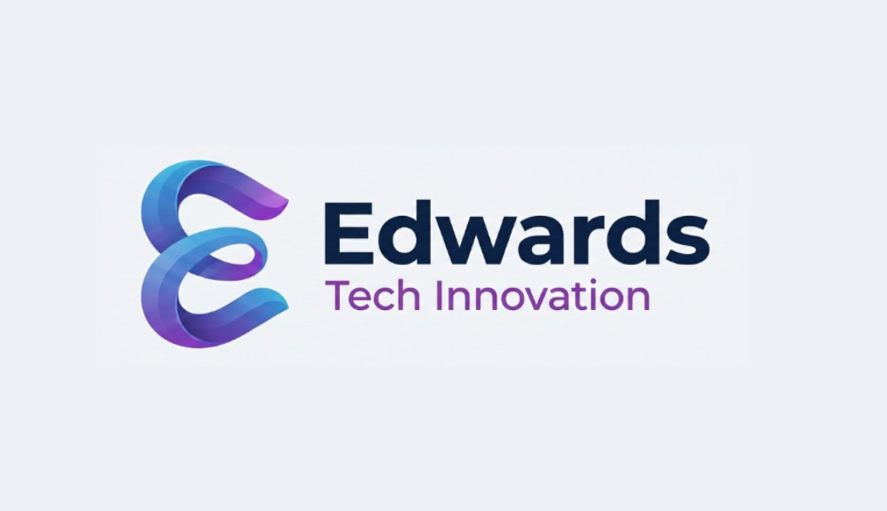

### AI-forward IT services and research — Peoria, IL

---

## Parent brand. Three operating departments.

### 🛠 Solutions
Applied AI ops for small operators. Practical automation, agent fleets, vault-based knowledge systems. Currently scoped to **proof-active mode** — engagements that produce concrete deliverables, not retainer-style consulting.

### 🧪 Labs
Open-source utilities and self-serve digital products. Where new patterns get road-tested in public. Public repos appear below as they ship.

### 🤖 Robotics
**Pre-commercial.** Physical-systems exploration. No timeline commitment.

---

## What we ship

Most work is currently private (Stage 1 — proof-active engagements). Public releases will land here as they harden.

> **Public repos:**
> - [`tcct-community`](https://github.com/Edwards-Tech-Innovation/tcct-community) — Free Android integration for Claude Code (TCCT Community Edition)

> **Reference / research (open):**
> - [`Dru-Edwards/CAM-OS`](https://github.com/Dru-Edwards/CAM-OS) — AI-native cognitive OS kernel
> - [`Complete-Arbitration-Mesh/CAM-PROTOCOL`](https://github.com/Complete-Arbitration-Mesh/CAM-PROTOCOL) — Open Standard for AI Routing and Arbitration
> - [`Dru-Edwards/SubstrateOS`](https://github.com/Dru-Edwards/SubstrateOS) — browser-native Linux playground

---

## How we work

- **Single operator + agent fleet.** Multi-agent system with vault-as-shared-memory.
- **Hardened agent doctrine.** Five-layer defense, owner-signed destructive actions, continuous battery testing.
- **Heterogeneous Mandate.** Multi-agent chains require architectural diversity between propagator and synthesizer to avoid same-model error amplification.
- **Truth-before-marketing.** If something's parked or pre-launch, this README says so.

---

## Built by

[**Dru Edwards**](https://github.com/ETPDEV) — Builder-integrator. Peoria, IL.

---

## Contact

- **General:** open an issue on a relevant repo
- **Services / engagements:** [edwardstechinnovations.com](https://edwardstechinnovations.com)
- **Legal / contracts:** not via GitHub

---

Solo-operated · Stage 1 Proof-active · License terms per-repo (BSL / Apache-2.0 / MIT as noted)

